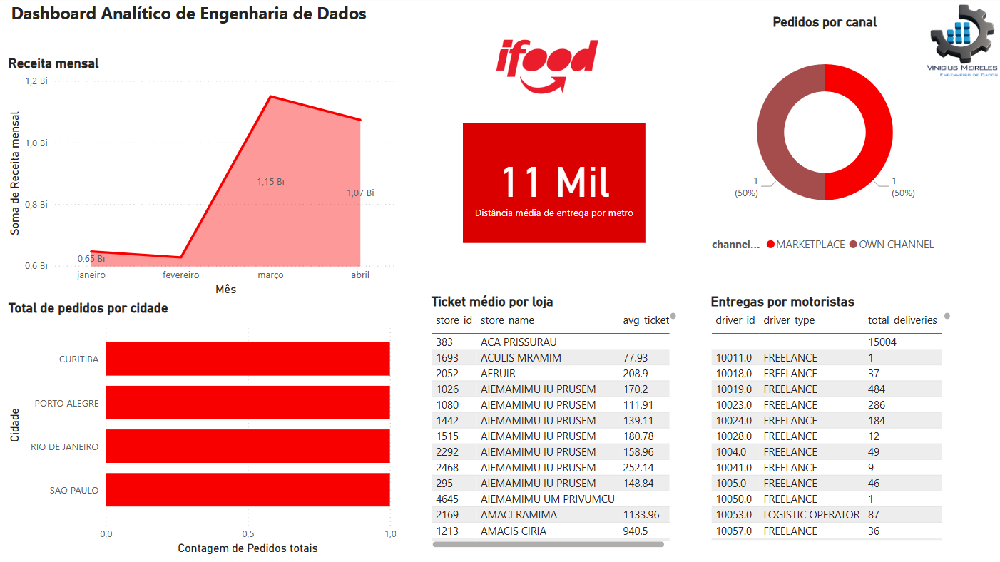

## 🛵 Projeto de Engenharia de Dados: Ifood - Brazilian Delivery Center

#### Este repositório contém o pipeline completo de Engenharia de Dados utilizando a arquitetura **Medallion (Bronze, Silver e Gold)** com dados públicos do [Brazilian Delivery Center no Kaggle](https://www.kaggle.com/datasets/nosbielcs/brazilian-delivery-center), além da análise de KPIs de negócio visualizados em **Power BI**.

### 📁 Estrutura do Projeto

```bash
├── Notebook
  ├── 01.Extract_bronze.ipynb         # Extração dos dados brutos (camada Bronze)
  ├── 02.transform_silver.ipynb       # Limpeza, normalização e enriquecimento dos dados (camada Silver)
  ├── 03.aggregate_gold.ipynb         # Agregações e cálculo de métricas de negócio (camada Gold)
  ├── 04.Analytics_Business.ipynb     # Análises de negócio e geração de insights
  ├── 5.Save_file_to_Power_BI.ipynb   # Exportação dos dados para visualização no Power BI
├── /data                           # Arquivos .parquet gerados em cada camada
  ├── /Raw                          # Arquivos importado .csv datasets da camada Raw     
  ├── /Bronze                       # * Arquivos transformados em Parket da camada Raw (dados brutos)
  ├── /Silver                       # * Arquivos processados por ETL
  ├── /Gold                         # * Arquivos prontos para produção e consumo
  ├── /File Parquet                 # * Arquivos parket para insight no Power BI 
├── /image                          # Imagens e diagrama do projeto
└── README.md

* Os arquivos são gerados pelos notebooks, no projeto só consta os arquivos .csv da camada Raw

⚙️ Tecnologias Utilizadas
Databricks Community Edition

Apache Spark (PySpark)

Parquet (armazenamento columnar)

Power BI (visualização)

Python 3.13

Kaggle Datasets API

````
### 🧱 Arquitetura Medallion


```
O projeto segue a arquitetura em camadas Medallion para processamento de dados:

🔸 Bronze
Extração direta dos arquivos .csv do dataset Kaggle.

Nenhuma transformação é aplicada nesta camada.

Armazenamento em formato Parquet para melhor performance.

🔹 Silver
Limpeza e padronização de dados:

Conversão de tipos.

Tratamento de valores nulos e duplicados.

Enriquecimento com novas colunas.

Estrutura pronta para análise.

🥇 Gold
Agregações e cálculos de indicadores de performance (KPIs):

Total de pedidos por mês.

Receita mensal por centro de entrega.

Avaliação média por entregador e centro de distribuição.

Métricas de eficiência operacional.

📊 Visualização no Power BI
O dashboard em Power BI apresenta os principais KPIs obtidos da camada Gold, com filtros interativos e visualizações:

- Receita mensal
- Nº de pedidos por canal
- Ticket médio por loja
- Distância média de entrega
- Pedidos por cidade
- Entregas por motorista
```


```
▶️ Execução
Clone o repositório:

bash
Copiar
Editar
git clone https://github.com/seu-usuario/nome-do-repositorio.git
Acesse os notebooks no Databricks Free Edition.

Execute os notebooks na ordem:

01.Extract_bronze.ipynb

02.transform_silver.ipynb

03.aggregate_gold.ipynb

04.Analytics_Business.ipynb

05.Save_file_to_Power_BI.ipynb

Importe os arquivos .parquet gerados no Power BI para análise.
```
📈 Exemplos de KPIs Gerados

<table>
  <thead>
    <tr>
      <th>Métrica</th>
      <th>Descrição</th>
    </tr>
  </thead>
  <tbody>
    <tr>
      <td>Receita mensal</td>
      <td>Total de vendas somadas por mês.</td>
    </tr>
    <tr>
      <td>Nº de pedidos por canal</td>
      <td>Quantidade de pedidos feita por cada canal de vendas.</td>
    </tr>
    <tr>
      <td>Ticket médio por loja</td>
      <td>Valor médio gasto por pedido em cada loja.</td>
    </tr>
    <tr>
      <td>Distância média de entrega</td>
      <td>Média das distâncias percorridas em entregas.</td>
    </tr>
    <tr>
      <td>Pedidos por cidade</td>
      <td>Total de pedidos agrupados por cidade (hub).</td>
    </tr>
    <tr>
      <td>Entregas por motorista</td>
      <td>Quantidade de entregas realizadas por cada motorista.</td>
    </tr>
  </tbody>
</table>

```

✅ Status do Projeto
✔️ Pipeline completo com camadas Bronze, Silver e Gold
✔️ Exportação para Power BI
✔️ Dashboard interativo publicado
❌ Agendamento automático (em desenvolvimento)

📌 To Do (Futuras Melhorias)
 Agendamento com Databricks Jobs

 Deploy do Power BI em workspace público

 Adição de testes automatizados no pipeline

```

```

📌 Referência dos Dados
Dataset: Brazilian Delivery Center - Kaggle
Autor: Nosbiel C Santos
Licença: Creative Commons (CC BY-NC-SA 4.0)

🧑‍💻 Autor
Vinicius Meireles
Engenheiro de Dados | Análise de Negócios com Power BI
```
LinkedIn: <a href= "https://www.linkedin.com/in/pviniciusmeireles/"> Linkedin </a>


